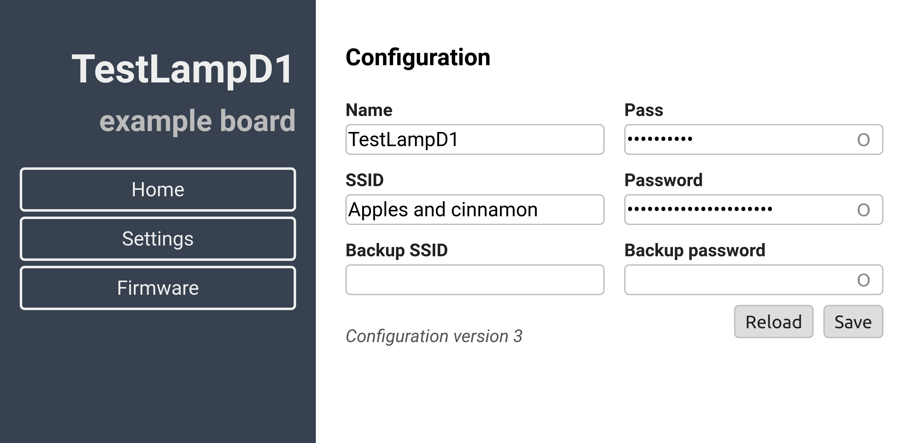
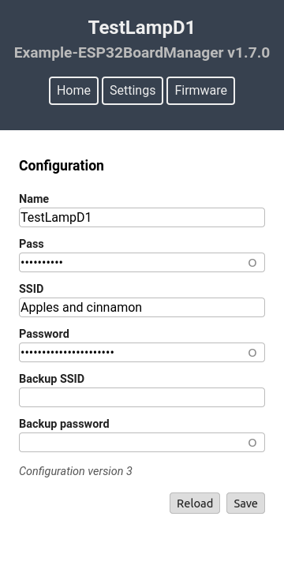

# Board Manager for ESP32

Each board based on ESP32 needs some standard steps for initialization and usage.
With the included `example` this is a *Getting started* code that can be used for any board.
It has:

- web server for commands, settings and OTA update
- responsive web interface
- configuration processing, loading and saving from NVS
- supports multiple WiFi configurations (default is 2, for a main and a backup Access Point)
- *standardized* initialization flow
- mDNS

This class should be used as a base for deriving dedicated manager classes for boards based on ESP32.

Uses the following ESP-IDF components:

- [ESP32HAL](https://calinradoni.github.io/ESP32HAL/) for peripherals initialization
- [ESP32SimpleOTA](https://github.com/CalinRadoni/ESP32SimpleOTA) for OTA firmware update

This component was tested with [ESP-IDF](https://github.com/espressif/esp-idf) **v4.1**.

This is a *work-in-progress* and should be tested before use.

## Documentation

The provided **example** is a working implementation that can be used as *Getting started* code.

### Web interface

    

        
    

    

        
The two images around this paragraph are showing the current web interface. 
         
        The web server pages are in <code>html/web/index.html.gz</code>, which is generated using the <code>html/build.sh</code> script. 
        The script needs <a href="https://nodejs.org/">Node.js</a> and a few other packages like: 
        <code>clean-css</code>, <code>clean-css-cli</code>, <code>html-minifier</code>, <code>inline-source</code>, <code>inline-source-cli</code>,
        <code>jshint</code> and <code>terser"</code> and it have these options:
        

        <ul style="list-style-position: inside;">
        <li>-h exit after showing the help message</li>
        <li>-c exit after cleaning the temporary and output directories</li>
        <li>-k clean before build</li>
        <li>-p build in production mode</li>
        <li>-n help for Node.js, npm and npm modules</li>
        </ul>
        

        See <a href="https://calinradoni.github.io/pages/200913-embedded-website-bash.html">Embedded website workflow - bash</a> for more information.
        

    

## Tests

I am using it with:

- ESP32-DevKitC
- pax-LampD1
- pax-DLED

## Development Environment

Currently uses the latest stable version of [Espressif IoT Development Framework](https://github.com/espressif/esp-idf), v4.1 as of December 2020.

Editing was done in [Visual Studio Code](https://code.visualstudio.com).

Version control with [Git](https://git-scm.com).

## License

This software and its documentation are released under the [GNU GPLv3](http://www.gnu.org/licenses/gpl-3.0.html) License. See the `LICENSE-GPLv3.txt` file.
