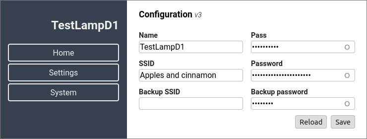

# Board Manager for ESP32


Each board based on ESP32 needs some standard steps for initialization and usage.
With the included `example` this is a *Getting started* code that can be used for any board.
It has:

- web server for commands, settings and OTA update
- responsive web interface
- configuration processing, loading and saving from NVS
- supports multiple WiFi configurations (default is 2, for a main and a backup Access Point)
- *standardized* initialization flow
- mDNS

This class should be used as a base for deriving dedicated manager classes for boards based on ESP32.

Uses the following ESP-IDF components:

- [ESP32HAL](https://calinradoni.github.io/ESP32HAL/) for peripherals initialization
- [ESP32SimpleOTA](https://github.com/CalinRadoni/ESP32SimpleOTA) for OTA firmware update

This component was tested with [ESP-IDF](https://github.com/espressif/esp-idf) **v4.1**.

This is a *work-in-progress* and should be tested before use.

## Documentation

The provided **example** is a working implementation that can be used as *Getting started* code.

### Web interface

This is the current web interface:




**Minimal web interface**

Use `idf.py menuconfig` and go to `Component config -> ESP32 Board Manager` to uncheck:

- Use index.html.gz
- Use favicon.ico

This minimal web interface needs the `html/web/index.html` file.

**Note:** you can also set these in `sdkconfig.defaults`:

```ini
CONFIG_ESP32BM_WEB_Compressed_index=n
CONFIG_ESP32BM_WEB_USE_favicon=n
```

**Standard web interface**

The web server pages are in `html/web/index.html.gz`, which is generated using the `html/build.sh` script.

The script needs [Node.js](https://nodejs.org) and a few other packages like:
`clean-css`, `clean-css-cli`, `html-minifier`, `inline-source`, `inline-source-cli`, `jshint` and `terser` and it have these options:

- -h exit after showing the help message
- -c exit after cleaning the temporary and output directories
- -k clean before build
- -p build in production mode
- -n help for Node.js, npm and npm modules

See [Embedded website workflow - bash](https://calinradoni.github.io/pages/200913-embedded-website-bash.html) for information about installation and usage of Node.js and required packages.

## Tests

I am using it with:

- ESP32-DevKitC
- pax-LampD1
- pax-DLED

## Development Environment

Currently uses the latest stable version of [Espressif IoT Development Framework](https://github.com/espressif/esp-idf), v4.1 as of December 2020.

Editing was done in [Visual Studio Code](https://code.visualstudio.com).

Version control with [Git](https://git-scm.com).

## License

This software and its documentation are released under the [GNU GPLv3](http://www.gnu.org/licenses/gpl-3.0.html) License. See the `LICENSE-GPLv3.txt` file.
